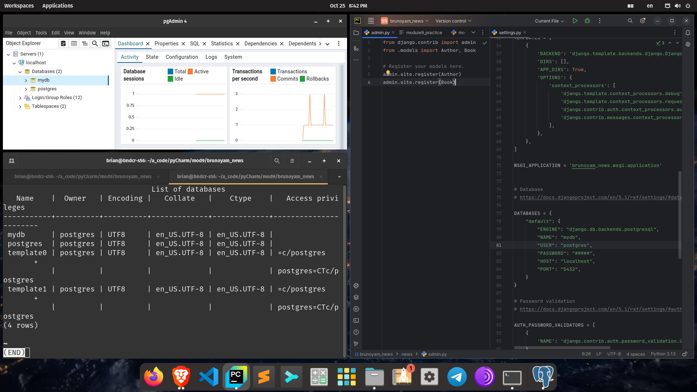
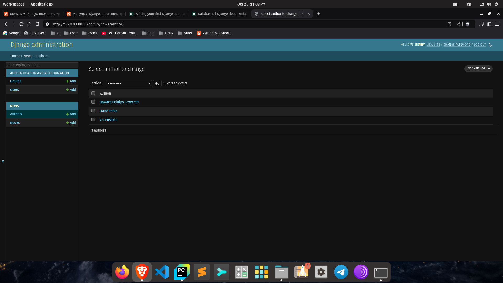
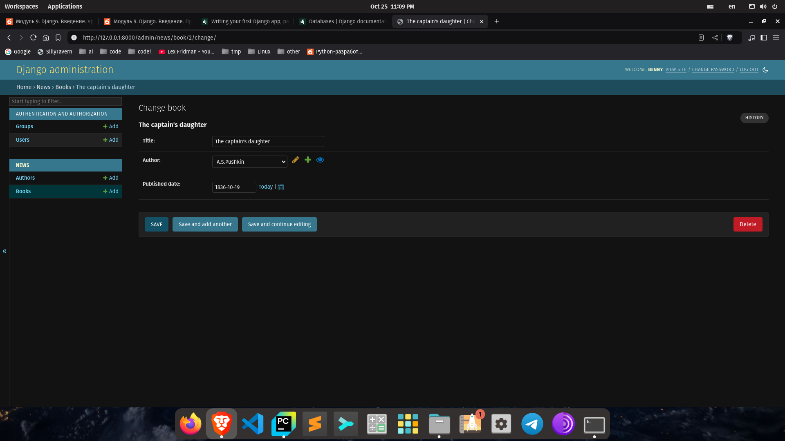
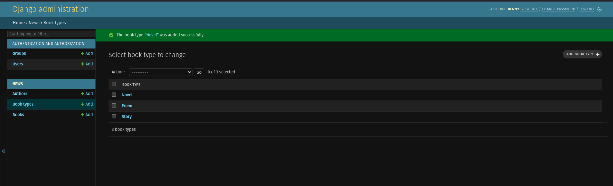
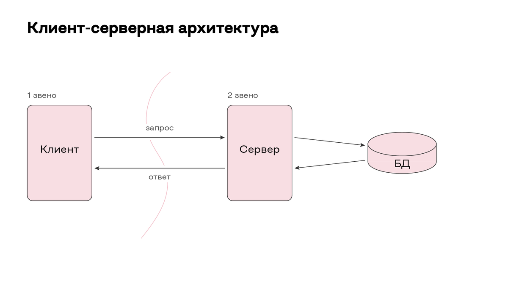

## m9 p1 lvl1

pip3 install Django 
django-admin startproject brunoyam_news 
python3 manage.py startapp news 
python3 manage.py runserver 
Ctrl-C 
python3 manage.py runserver 
python manage.py makemigrations 
python manage.py migrate 
python manage.py createsuperuser 

В терминале, переходим в директорию, в которой хотим создать проект. 
С помощью одной из команд выше создаём новый проект. 
По желанию создаём новое приложение для проекта. 
Устанавливаем нужные нам настройки в settings.py . 
Запускаем локальный сервер для проверки отсутствия ошибок. 
Останавливаем сервер, добавляем модели в models.py . 
Регистрируем модели в admin.py . 
Запускаем сервер, выполняем миграции (на данном этапе это просто создание таблиц наших моделей в бд). 
Создаём суперюзера для админ панели. 
Заходим в админ панель, проверяем всё, что нужно. 
Готово. 

## m9 p1 lvl2

Выжимка важных моментов при работе с Django и базами данных в Django: 
1) Существует некое соответствие версий фреймворка Django и python. 
Важно учитывать это, при начале работы с ними, так как некоторые версии Django 
могут не подходить к некоторым версиям python, и наоборот. 
2) При именовании новых проектов, нужно избегать имён и названий встроенных в язык python 
и фреймворк Django. Условные проекты с названием django, или test вызовут конфликты. 
3) Важно не использовать встроенный Django сервер для "продакшна", он создан исключительно 
для работы во время разработки. 
4) Django фреймворк поддерживает большое количество баз данных третьих сторон 
но поддерживает по умолчанию только те, работа с которыми безопасна. 
5) Django ожидает, что все базы данных используют кодировку UTF-8. Если она 
отличается это может вызвать непредсказуемое поведение, ошибки, и результаты. 
6) Сейчас для работы с PostgreSQL в Django требуется адаптер psycopg, но ожидается 
его удаление в будущем. 
7) Версии Django и его ORM возможности отличаются для баз данных третьих сторон официально 
не включенных в поддержку Django. 

Клиент (любое устройство способное подключаться к серверу), делает запрос для получения  
каких либо данных. Если запрос корректный, сервер обрабатывает запрос и, если нужно,  
делает запрос к базе данных, для получения каких либо данных. После обработки запроса от сервера  
база данных возвращает какие либо "сырые" данные серверу, который их обрабатывает следуя запросу  
от клиента, и возвращает клиенту обработанные данные. 
Пример: 
Пользователь ввёл логин и пароль на странице регистрации и нажал "зарегистрироваться". 
Сервер делает запрос к базе данных для проверки наличия данного логина. 
База данных возвращает ответ, что такого логина нет в базе. 
Сервер проверяет корректность пароля. 
Если всё в порядке, то сервер возвращает пользователю редирект на другую страницу сайта  
с надписью "Добро пожаловать". В то же время, сервер снова делает запрос к базе данных  
на добавление нового логина и пароля в базу. 

Три примера популярных веб-приложений созданных с помощью Django: 
1) Instagr## - популярное в интернете приложение для ведения личного фото блога. 
(огромное число пользователей). 
2) Pinterest - Социальная сеть для размещения и обмена фото и видео. 
(большое число пользователей). 
3) Spotify - популярный веб сервис для транслирования музыки, подкастов, радио, аудиокниг. 
(Огромное число пользователей). 

## m9 p1 lvl3

Django: 
+) Фуллстек веб фреймворк. 
+) По умолчанию имеет все необходимые компоненты для разработки и работы с веб приложениями. 
+) По умолчанию имеет ORM и поддержку многих баз данных. 
+) Универсальность и расширяемость. 
+) Model View Template - система разделения моделей, интерфейса, и логики. 
+) Высокая безопасность по умолчанию. В среднем, довольно высокая скорость работы.

-) Слишком объемный для маленьких проектов, для которых не нужно так много функций. 
-) Из-за особенностей дизайна может казаться монолитным и сложно изменяемым. 
-) Особенности ORM не позволяют легко работать с некоторыми базами данных.

Flask: 
+) Минималистичный веб фреймворк. 
+) Небольшой размер позволяет выполнять маленькие операции очень быстро. 
+) Отлично подходит для небольших проектов. 
+) Очень гибкий. Может быть расширен благодаря модульной системе расширений. 
+) Не имеет моделей по умолчанию, что способствует большему количеству баз данных для работы.

-) Не подходит для больших и сложных веб приложений. 
-) Из-за не самой высокой популярности нет большого коммьюнити способного помочь решить проблемы. 
-) Нет ORM, встроенной системы безопасности, админ панели, конкретной архитектуры.

FastAPI: 
+) Минималистичный веб апи фреймворк. 
+) Большая поддержка асинхронности. 
+) Легко изучить. Большое коммьюнити. 
+) Высокая скорость и производительность. 
+) Встроенная удобная система для документирования.

-) Низкая безопасность. 
-) Ограниченный функционал и расширяемость. 
-) Нет админ панели, частичная поддержка ORM, без определенных знаний не раскрывает потенциал.

После инициализации проекта были созданы:  
<blockquote>1)manage.py - доступ к встроенным командам Django (Создание файлов, создание сервера, миграции). 
2)Директория название_проекта: 
<blockquote>1)__init__.py - файл для какого то кода, который должен быть обработан при запуске проекта. 
2)asgi.py - для развёртывания проекта (новый стандарт). 
3)settings.py - хранит все настройки проекта. 
4)urls.py - пути/ссылки страниц проекта. 
5)wsgi.py - для развёртывания проекта (старый стандарт). 
